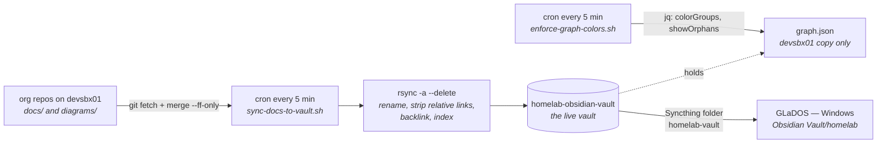

# homelab-obsidian-vault

> The Obsidian vault for the vollminlab homelab, plus the two cron scripts that keep it in sync
> with every repo's `docs/`.

[](https://github.com/vollminlab/homelab-obsidian-vault/actions/workflows/secret-scanning.yaml)


Documentation for the homelab lives next to the code that it describes — one `docs/` folder per
repo — which is right for the person editing it and useless for the person trying to see how ten
repos fit together. This repo closes that gap by mirroring every repo's `docs/` into one Obsidian
vault every five minutes, rewriting the links on the way in so the resulting graph is actually
navigable.

The non-obvious part: **this git repo *is* the vault.** There is no build step and no separate
copy. The working tree checked out at `~/repos/vollminlab/homelab-obsidian-vault` on `devsbx01` is
the live Obsidian vault that Syncthing replicates to Windows. Mirrored docs land directly in the
working tree and are gitignored, so the vault on disk is deliberately a superset of what is
committed here.

---

## Architecture



---

## The sync pipeline

`scripts/sync-docs-to-vault.sh` is one pass over `repos=()`. Per repo, in order:

| Step | What happens | Why it is there |
|---|---|---|
| 1. Fast-forward | `git fetch origin` then `git merge --ff-only` in the source repo | Without it the vault mirrors whatever is checked out on this host, which drifts from `origin` silently |
| 2. Mirror | `rsync -a --delete <repo>/docs/ → repos/<repo>/docs/` | `--delete` means a doc removed upstream disappears from the vault too |
| 3. Rename | Apply the `renames` map to collision-prone filenames | Obsidian resolves wikilinks by short filename — see below |
| 4. Strip | Inline `python3` regex deletes `[text](../path)` and bare `../path` | `../` targets do not exist inside the vault; they render as ghost nodes |
| 5. Backlink | Prepend `← [[<repo>]]` under the first heading | Gives every mirrored doc an edge back to its repo index in the graph |
| 6. Index | Rebuild the `## Unlisted Docs` section of `repos/<repo>/<repo>.md` | Nags about docs nobody filed by hand |
| 7. Diagrams | `rsync` + backlink for `<repo>/diagrams/` if present | Same treatment, no renames or index entry |

The vault's own directories (`architecture/`, `roadmap/`, `runbooks/`, `diagrams/`) are handled
first and separately: they are already in the working tree, so they get backlink injection in
place and no copy step at all.

The script sets `sync_failed=1` on any rsync or git failure and exits 1 at the end, but does **not**
abort mid-run — one unreadable repo must not stop every later repo from syncing.

### Fast-forward guards

`pull_or_report()` will only ever fast-forward. Every other situation is reported and then left
exactly as it was — this script mirrors docs, it does not get to modify anyone's working state.

| Condition | Behaviour |
|---|---|
| No `.git` directory | Skipped silently |
| Detached HEAD | `⚠`, mirrors on-disk docs |
| Uncommitted **tracked** changes | `⚠`, mirrors on-disk docs |
| Branch has no upstream | `⚠`, no pull |
| `git fetch` fails | `✗`, `sync_failed=1` |
| Cannot fast-forward | `✗`, left untouched, `sync_failed=1` |
| On a branch other than `main`/`master` | `⚠` — the vault will present unmerged docs as current |

Two details in that function are load-bearing and easy to undo by accident:

- **`git status --porcelain --untracked-files=no`.** Plain `--porcelain` counts untracked files, so
  a single stray scratch directory would park a repo on whatever commit it happened to be on and
  never sync it again — silently, which is the exact failure the fast-forward exists to prevent.
- **`GIT_TERMINAL_PROMPT=0`.** Under cron there is no TTY. A credential prompt would hang the run
  forever instead of failing.

The vault repo itself is deliberately excluded from the fast-forward loop: this script lives inside
it, and bash reads a script incrementally while running it, so fast-forwarding mid-execution can
change the file underneath the running interpreter. Instead the script fetches and prints a warning
when the vault is behind `origin`, and it is pulled by hand after a merge.

### Backlink injection

`inject_backlink()` is idempotent — it greps for the exact `← [[repo]]` marker and returns early if
present. Otherwise `awk` inserts the link two lines below the first `^#` heading, or prepends it
when the file has no heading.

The heading lookup uses `grep -n -m1`, not `grep -n | head -1`. `head` exits after one line, so
grep's next write takes SIGPIPE; under `set -o pipefail` that fails the pipeline and fires the
`|| echo "0"` fallback *after* the real line number was captured, making the variable the two-line
value `"1 0"`. `[ "1 0" -gt 0 ]` then errors, and since `set -e` is exempt inside `if`, it silently
takes the else branch and prepends the backlink above the heading. Latent rather than active — grep
only blocks once its matches exceed the 64 KB pipe buffer, roughly 4000 heading lines in one file —
but `-m1` removes the possibility entirely.

### Unlisted Docs

`update_index()` deletes everything from `^## Unlisted Docs` to EOF, strips trailing blank lines,
then re-appends an entry for every mirrored `.md` whose basename does not already appear somewhere
in the index. Titles come from the file's first `^#` heading.

- The trailing-blank-line strip is not cosmetic. The append emits a leading newline before the
  header and the `sed` only deletes from the header onward, so without it every run leaks one blank
  line at EOF — 288 lines a day at a five-minute cadence.
- `docs/superpowers/` is pruned from the scan. Those are completed implementation plans and design
  specs: archival records, not operational docs anyone needs to find from an index. They stay in the
  vault, the graph and search — they just do not earn an index entry. Before the prune the k8s index
  carried 40 unlisted entries, 34 of them superpowers plans, which buried six real runbooks nobody
  had filed. The nag is only useful if a non-empty section means something needs filing.

---

## Filename collisions

Obsidian resolves wikilinks by short filename, cluster-wide. Two repos with an `architecture.md`
produce one working link and one ghost node. Step 3 of the pipeline renames the loser on the way in;
the source repo keeps its natural filename.

| Source path | Renamed to |
|---|---|
| `pihole-flask-api/docs/architecture.md` | `pihole-architecture.md` |
| `pihole-flask-api/docs/operations.md` | `pihole-operations.md` |
| `VMDeployTools/docs/architecture.md` | `vmdeploytools-architecture.md` |
| `VMDeployTools/docs/configuration.md` | `vmdeploytools-configuration.md` |
| `VMDeployTools/docs/operations.md` | `vmdeploytools-operations.md` |
| `github-admin/docs/overview.md` | `github-admin-overview.md` |
| `github-admin/docs/adding-repos.md` | `github-admin-adding-repos.md` |
| `longhorn-rebalancing-controller/docs/overview.md` | `longhorn-rebalancing-controller-overview.md` |
| `groupme_exporter/docs/architecture.md` | `groupme-architecture.md` |
| `k8s-vollminlab-cluster/docs/roadmap.md` | `cluster-roadmap.md` |

Add a row to the `renames` array in `scripts/sync-docs-to-vault.sh` whenever a new doc's basename
already exists in another repo.

---

## Graph colours

`scripts/enforce-graph-colors.sh` rewrites `.obsidian/graph.json` with `jq`, setting `.colorGroups`
to a fixed 13-entry array and `.showOrphans` to `false`. It exists because Obsidian overwrites that
file on interaction — and when it does, it replaces the `colorGroups` array with the integer `1000`,
which is why the guard tests the JSON *type* and not just the length:

```bash
current_count=$(jq 'if (.colorGroups | type) == "array" then (.colorGroups | length) else 0 end' "$GRAPH_JSON" ...)
if [ "$current_count" -lt 13 ] || [ "$current_orphans" = "true" ]; then
```

Groups are path queries, not file lists, so new docs pick up their repo's colour with no config
change. Colours are stored as decimal integers — convert with
`python3 -c "print(int('BCBD22', 16))"`.

| Group | Query scope | Colour | Hex |
|---|---|---|---|
| 1 | `Home.md`, `CLAUDE.md`, `memory.md` | Gold | `#FFD700` |
| 2 | All eleven repo index files, by explicit path | Red | `#FF0000` |
| 3 | `repos/k8s-vollminlab-cluster/` | Steel blue | `#1F77B4` |
| 4 | `repos/homelab-infrastructure/` | Green | `#2CA02C` |
| 5 | `repos/VMDeployTools/` | Orange | `#FF7F0E` |
| 6 | `repos/pihole-flask-api/` | Brown | `#795548` |
| 7 | `repos/github-admin/` | Teal | `#00897B` |
| 8 | `repos/groupme_exporter/` | Cyan | `#17BECF` |
| 9 | `repos/masters-league/` | Amber | `#F9A825` |
| 10 | `repos/shlink-ingress-controller/` | Pink | `#EC407A` |
| 11 | `repos/longhorn-rebalancing-controller/` | Blue grey | `#607D8B` |
| 12 | `repos/vollmint/` | Olive | `#BCBD22` |
| 13 | `repos/homelab-obsidian-vault/` + `architecture/` `roadmap/` `runbooks/` `diagrams/` | Deep purple | `#9C27B0` |

The intended hierarchy is gold hub → red repo indexes → per-repo doc colours, so the index group is
listed ahead of the path-prefix groups it needs to override.

**The threshold is the step people forget.** `-lt 13` is the current repo count plus the gold and
red groups. Adding a repo adds one group, so the comparison must be incremented in the same commit —
otherwise the guard is satisfied by the old array and the new colour is never applied.

**The enforcer only maintains the `devsbx01` copy.** `.obsidian/` is excluded from Syncthing, so the
Windows install has its own `graph.json` that no cron job touches; a new repo's colour has to be
added there by hand. This is deliberate — see [Syncthing](#syncthing).

---

## Repos tracked

Eleven repos, in the order of the `repos=()` array in `scripts/sync-docs-to-vault.sh`.

| Repo | What it is |
|---|---|
| `k8s-vollminlab-cluster` | GitOps-managed Kubernetes cluster, Flux CD |
| `homelab-infrastructure` | Terraform, VM provisioning, network infrastructure |
| `groupme_exporter` | GroupMe chat export tool |
| `pihole-flask-api` | Flask/Gunicorn REST API for Pi-hole DNS records |
| `github-admin` | Terraform-managed GitHub org configuration |
| `VMDeployTools` | PowerShell module for vSphere VM provisioning |
| `masters-league` | Masters Tournament fantasy golf league viewer |
| `shlink-ingress-controller` | Kubernetes ingress controller for Shlink short links |
| `longhorn-rebalancing-controller` | Byte-aware Longhorn replica rebalancer |
| `vollmint` | Household budget tracker — SimpleFIN + Venmo CSV |
| `homelab-obsidian-vault` | This repo — vault-native dirs, backlinked in place, never copied |

Two of the org's thirteen repos are not covered: **`ansible-playbooks`** and **`.github`**. Neither
has a `docs/` folder yet, so there is nothing to mirror — onboarding either one starts with creating
that folder, not with editing the sync script.

---

## Cron and logs

Both jobs run from the `vollmin` crontab on **`devsbx01`**, by absolute path — cron has no working
directory to inherit.

| Schedule | Command | Log |
|---|---|---|
| `*/5 * * * *` | `~/repos/vollminlab/homelab-obsidian-vault/scripts/sync-docs-to-vault.sh` | `~/sync-docs.log` |
| `*/5 * * * *` | `~/repos/vollminlab/homelab-obsidian-vault/scripts/enforce-graph-colors.sh` | `~/graph-colors.log` |

```bash
crontab -l                  # confirm both entries
tail -f ~/sync-docs.log     # ✓ per repo, ⚠ for skipped pulls, ✗ for failures
tail -f ~/graph-colors.log  # one line only when colours were re-applied
```

Both scripts are safe to run by hand and are idempotent.

---

## Vault structure

```
architecture/          # cross-repo architecture docs — source of truth is this repo
roadmap/               # planned work across the homelab
runbooks/              # cross-repo operational procedures
diagrams/              # cross-repo diagrams
repos/<repo>/
  <repo>.md            # vault index file — hand-written, committed here
  docs/                # mirror of the repo's docs/ — generated, gitignored
  diagrams/            # mirror of the repo's diagrams/ — generated, gitignored
scripts/               # the two cron scripts
Home.md                # central hub: repo list, network topology, integration map
CLAUDE.md              # Claude Code context for vault sessions
memory.md              # cross-session continuity log
```

`.gitignore` excludes `repos/*/docs/` and `repos/*/diagrams/` — that content is derived and already
has a git history in its own repo. It also excludes `.obsidian/` (app state), `.stfolder` (a
Syncthing marker) and `.worktrees/`.

**Never edit anything under `repos/<repo>/docs/` or `repos/<repo>/diagrams/`.** The next cron run
overwrites it. The source of truth is always the originating repo.

---

## Syncthing

| Folder ID | devsbx01 path | Windows path — device `GLaDOS` |
|---|---|---|
| `homelab-vault` | `~/repos/vollminlab/homelab-obsidian-vault` | `C:\Users\Scott\Documents\Obsidian Vault\homelab` |

`.stignore` keeps `.git` and `.obsidian` out of the sync:

```
.git
.obsidian
!.obsidian/graph.json
```

Excluding `.obsidian` is the fix for a conflict loop that used to run continuously: the enforce
script wrote colour groups on `devsbx01`, Obsidian on Windows overwrote `graph.json` with
`colorGroups: 1000`, and Syncthing pushed the Windows version straight back. With the directory
ignored, each side keeps its own graph config and the loop cannot form. Syncthing takes the first
matching pattern, so the trailing `!.obsidian/graph.json` line never comes into play.

---

## Adding a new repo

The canonical checklist is `architecture/obsidian-setup.md`. In short:

1. **Create `docs/`** in the repo — and `diagrams/` if it has any. Nothing outside those two folders
   is ever mirrored.
2. **Add the repo to `repos=()`** in `scripts/sync-docs-to-vault.sh`, and add `renames` entries for
   any doc whose basename already exists in another repo.
3. **Create `repos/<repo>/<repo>.md`** — the vault index file, using the template below.
4. **Add `[[<repo>]]` to `Home.md`** under Infrastructure or Side projects.
5. **Add a colour group** to `scripts/enforce-graph-colors.sh`, add the repo to the red index-file
   query, and **increment the `-lt` threshold**.
6. **Add rows to the `Home.md` integration map** if the repo calls, or is called by, another repo at
   runtime.
7. **Commit, PR, merge, then run both scripts by hand** to verify before the next cron tick.

```bash
~/repos/vollminlab/homelab-obsidian-vault/scripts/sync-docs-to-vault.sh
~/repos/vollminlab/homelab-obsidian-vault/scripts/enforce-graph-colors.sh
```

Docs should appear under `repos/<repo>/docs/`, each carrying a `← [[<repo>]]` backlink.

Steps 2 and 5 are the two that silently half-work: a repo in `repos=()` with no colour group syncs
but renders in the graph's default grey, and a colour group added without bumping the threshold is
never applied at all.

### Vault index file template

```markdown
# repo-name

← [[Home]]

One-line description.

## Docs

- [[repos/repo-name/docs/doc-name|Title]] — description

## Key facts

- Facts in plain text — NO cross-repo wikilinks here
- See [[Home]] for integration map
```

---

## Rules for writing docs in other repos

These apply to every repo in the org. Each exists because of how the Obsidian graph resolves links,
not because of anything about markdown — which is why they look arbitrary from inside a single repo.

| Rule | Why |
|---|---|
| **All docs go in `<repo>/docs/`** | The sync script mirrors `docs/` and `diagrams/` and nothing else. A doc anywhere else is invisible to the vault, with no error to tell you. |
| **No `../` relative links** | A relative path that resolves in the repo points nowhere inside the vault, so Obsidian renders it as a ghost node — a grey dot for a file that does not exist. The sync script strips these, but only on its next run, and stripping is lossy: `[text](../path)` becomes bare `text` and the link is gone. Write the target as a wikilink or plain text instead. |
| **No cross-repo wikilinks in synced docs** | Every repo's docs already link to their own index, and every index links to `Home`. Adding `[[other-repo]]` inside a doc short-circuits that hierarchy and collapses the hub-and-spoke layout into a hairball. Mention other repos in plain text; put genuine runtime relationships in the `Home.md` integration map, which is the one place the graph is meant to converge. |
| **Never add `← [[repo-name]]` by hand** | The sync script injects it, positioned two lines below the first heading. A hand-written one in a different position is not matched by the idempotency grep in some formats, and it belongs to the mirror rather than the source — the repo's own rendering on GitHub gets a dangling wikilink for no benefit. |

Filenames carry no dates, with one exception: incident postmortems use `YYYY-MM-DD-description.md`,
because there the date *is* the identifier. Everywhere else the date belongs in the document body.
